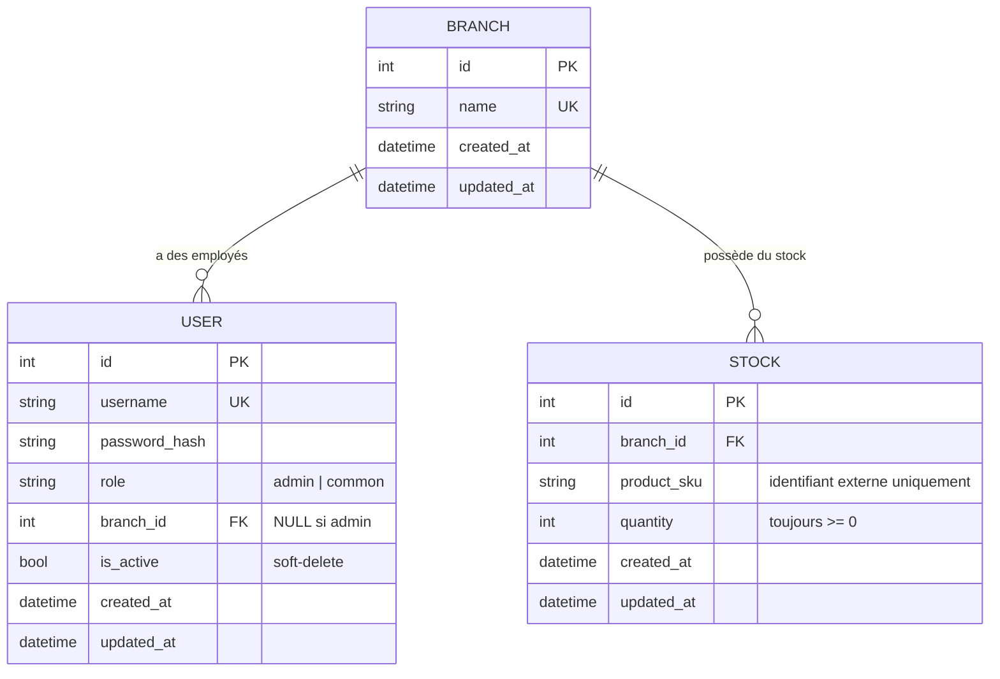

# HBntory — Conception de la base de données (Task 1)

> Documente le schéma relationnel, les modèles SQLAlchemy, la stratégie
> d'initialisation et les règles de validation du stock. Complète le code du
> dossier `backoffice/` (`models.py`, `database.py`, `seed.py`,
> `validation.py`, `stock_service.py`).

---

## 1. Schéma relationnel

Le Backoffice ne stocke que trois tables : `branches`, `users`, `stock`.
Aucune table produit n'existe — les détails produit viennent exclusivement de
l'API Produit externe (voir [architecture_and_planning.md](architecture_and_planning.md)).

### 1.1 Diagramme



`STOCK` ne référence aucune table produit : `product_sku` est une simple
chaîne qui sert de clé de correspondance avec l'API Produit externe.

### 1.2 Table `branches`

| Colonne | Type | Contrainte | Rôle |
|---|---|---|---|
| `id` | int | PK | identifiant de la branche |
| `name` | string(100) | UNIQUE, NOT NULL | nom de la branche (ex. "Lyon") |
| `created_at` / `updated_at` | datetime | server default `now()` | traçabilité |

### 1.3 Table `users`

| Colonne | Type | Contrainte | Rôle |
|---|---|---|---|
| `id` | int | PK | identifiant utilisateur |
| `username` | string(50) | UNIQUE, NOT NULL | identifiant de connexion |
| `password_hash` | string(255) | NOT NULL | hash Argon2id (jamais le mot de passe en clair) |
| `role` | string(20) | CHECK `IN ('admin','common')` | rôle applicatif |
| `branch_id` | int, nullable | FK → `branches.id` | branche assignée (NULL uniquement pour l'admin) |
| `is_active` | bool | default `True` | soft-delete : `False` = utilisateur supprimé |
| `created_at` / `updated_at` | datetime | server default `now()` | traçabilité |

Deux contraintes `CHECK` imposent au niveau base de données les règles du
sujet :

- `valid_role` : `role` ne peut être que `'admin'` ou `'common'`.
- `branch_rule_by_role` : `(role='admin' AND branch_id IS NULL) OR (role='common' AND branch_id IS NOT NULL)`.
  Cette contrainte garantit à elle seule que **l'admin n'a jamais de branche**
  et qu'**un utilisateur commun a toujours exactement une branche** — même en
  cas de bug applicatif, la base refuse la ligne.

Le soft-delete utilise `is_active`, pas de suppression physique : un
utilisateur "supprimé" reste en base (historique, intégrité des FK depuis
`stock` ou des logs futurs) mais ne peut plus se connecter (vérifié au
login, voir Task 2).

### 1.4 Table `stock`

| Colonne | Type | Contrainte | Rôle |
|---|---|---|---|
| `id` | int | PK | identifiant de la ligne de stock |
| `branch_id` | int | FK → `branches.id`, NOT NULL | branche concernée |
| `product_sku` | string(50) | NOT NULL | identifiant externe du produit (ex. `HB-LAP-1001`) |
| `quantity` | int | CHECK `>= 0`, default 0 | quantité disponible |
| `created_at` / `updated_at` | datetime | server default `now()` | traçabilité |

Deux contraintes :

- `uq_branch_product` (UNIQUE sur `branch_id, product_sku`) : une seule ligne
  de stock par produit et par branche — pas de doublons à additionner.
- `quantity_non_negative` (CHECK `quantity >= 0`) : dernier rempart contre un
  stock négatif, même si la couche applicative a un bug.

Aucune colonne de nom, description, prix ou image : `product_sku` est le
seul lien vers le catalogue externe, conformément à la contrainte du sujet.

## 2. Modèles SQLAlchemy

Les modèles sont dans [`backoffice/models.py`](../backoffice/models.py) :
`Branch`, `User`, `Stock`. Ils reprennent exactement le schéma ci-dessus avec
les relations SQLAlchemy `relationship()` :

- `Branch.users` / `User.branch` : relation un-à-plusieurs bidirectionnelle.
- `Branch.stock_items` / `Stock.branch` : idem pour le stock.

Ces relations sont un confort d'écriture Python (`branch.users`,
`branch.stock_items`) ; les règles d'intégrité réelles restent portées par
les clés étrangères et contraintes `CHECK` déclarées dans `__table_args__`.

## 3. Initialisation des données

Le script [`backoffice/seed.py`](../backoffice/seed.py) sert de stratégie
d'initialisation (pas de migration Alembic pour ce projet : le schéma est
simple et stable une fois défini, `Base.metadata.create_all()` suffit pour
créer les tables au premier lancement).

Il crée :

- les tables (`create_all`) ;
- 2 branches (Lyon, Paris) ;
- 1 admin, sans branche, rôle `admin` ;
- du stock d'exemple sur des `sku` réellement présents dans l'API Produit.

Le mot de passe admin n'est **jamais écrit en clair dans le code** : il est
lu depuis la variable d'environnement `ADMIN_PASSWORD` et seul son hash
Argon2id (via `security.hash_password`) est stocké :

```bash
ADMIN_PASSWORD="unMotDePasseSolide" python seed.py
```

Le script est idempotent : s'il détecte des utilisateurs déjà en base, il ne
fait rien, pour éviter d'écraser des données existantes en cas de
ré-exécution accidentelle.

## 4. Règles de validation du stock

Cf. le sujet : « quantité jamais négative », « quantité positive entière
requise », « branche valide », « sku existant dans l'API Produit ». Réponse
détaillée dans [`backoffice/validation.py`](../backoffice/validation.py)
(docstring) et appliquée dans
[`backoffice/stock_service.py`](../backoffice/stock_service.py).

### 4.1 Où placer la validation ? Deux couches complémentaires

| Couche | Ce qu'elle garantit | Exemple |
|---|---|---|
| **Base de données** (contraintes `CHECK`/`FK`/`UNIQUE` dans `models.py`) | Intégrité ultime des données locales, même en cas de bug applicatif | `quantity >= 0`, une seule ligne par (branche, sku) |
| **Application** (`validation.py`, `stock_service.py`) | Règles métier et tout ce qui dépend d'un service externe | quantité strictement positive et entière ; le sku existe dans l'API Produit (nécessite un appel HTTP, impossible à exprimer en SQL) |

Règle de décision retenue : **la base garantit l'intégrité des données
locales ; l'application garantit les règles métier et tout ce qui dépend de
services externes.** Une contrainte SQL ne peut pas appeler l'API Produit,
donc cette vérification ne peut vivre que côté application — mais une
`CHECK quantity >= 0` reste utile même si l'application a un bug, donc les
deux couches sont conservées plutôt qu'une seule.

### 4.2 Détail des règles et de leur implémentation

1. **Quantité jamais négative** : `remove_stock()` calcule
   `stock.quantity - quantity` et refuse l'opération (`ValueError`) si le
   résultat serait négatif, *avant* d'écrire en base. La contrainte
   `quantity_non_negative` est le filet de sécurité final.
2. **Quantité entière strictement positive** : `validate_positive_int()`
   rejette explicitement les booléens (sous-type de `int` en Python), les
   flottants, zéro et les valeurs négatives.
3. **Branche valide** : `_get_branch_or_raise()` vérifie que la branche
   existe avant toute opération de stock (`session.get(Branch, branch_id)`).
4. **Sku existant dans l'API Produit** : `product_exists()` interroge l'API
   Produit externe (`GET /api/v1/products/{sku}`). Si l'API est injoignable
   ou lente, la fonction ne suppose jamais que le produit existe : elle
   retourne `False` et l'opération est refusée (fail-safe, pas
   fail-open). Ce contrôle est paramétrable (`check_product_api=True` par
   défaut) pour permettre des tests hors-ligne sans dépendre du conteneur
   Docker de l'API.

### 4.3 Points d'entrée

`stock_service.add_stock()` et `stock_service.remove_stock()` sont le **seul
point d'entrée recommandé** pour modifier le stock : toute la logique
d'autorisation (Task 2, branche assignée à l'utilisateur courant) et de
validation passe par ces fonctions plutôt que par une manipulation directe
des objets `Stock`.

---

## Récapitulatif des livrables Task 1

- Documentation du schéma : ce document (section 1).
- Modèles SQLAlchemy : [`backoffice/models.py`](../backoffice/models.py).
- Script d'initialisation : [`backoffice/seed.py`](../backoffice/seed.py).
- Explication des règles de validation : section 4 ci-dessus.
